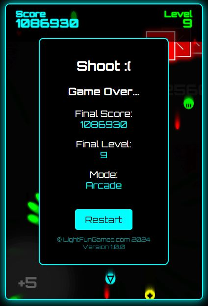

# Shoot - A Modern Retro Shoot'em Up Game

## Description
"Shoot" is a modern retro shoot'em up game that combines the thrill of classic arcade shooters with contemporary graphics and sound effects. The game features multiple modes including Arcade, Kid, and Raw modes, each offering unique challenges and gameplay styles. The goal is to last 10 levels and set a high score.

## Features
- **Multiple Game Modes:** Choose from Arcade, Kid, or Raw mode to suit your gameplay preference.
- **Dynamic Levels:** Experience increasing difficulty with advanced enemy configurations and behaviors across different levels.
- **Power-Ups:** Enhance your ship with power-ups like rapid fire, shields, and multi-shot to survive longer and beat high scores.
- **Custom Graphics and Sound:** Enjoy a visually appealing game with custom graphics and thrilling sound effects.
- **Responsive Design:** Play the game on any device with a fully responsive canvas and touch/mouse controls.

## Screenshots



## Installation
No installation necessary! Simply open the `index.html` file in a modern web browser to start playing.

## Controls
- **Mouse Movement:** Move your ship by moving the mouse.
- **Touch Movement:** Use touch controls on mobile devices.
- **Auto Fire:** The ship fires automatically.

## Technologies Used
- HTML5
- CSS3
- JavaScript

## Modifying Levels

The game's difficulty and features can be customized by modifying the level configuration. To do this, locate the `levelConfig` object in the `index.html` file. Here's an explanation of the available options:

### Global Configuration
- `maxLevel`: The maximum number of levels in the game.
- `defaultLevelDuration`: The default duration of each level in seconds.

### Level-Specific Configuration
Each level (1-10) can be customized with the following options:

- `enemySpeed`: The speed of enemies. Can be a fixed number or an object with `base` and `variation` properties for randomized speeds.
- `enemySize`: The size of enemies. Can be a fixed number or an object with `min` and `max` properties for varied sizes.
- `enemyShape`: The shape of enemies. Can be a string ('triangle', 'square', 'diamond', 'hexagon') or an array of shapes for variety.
- `enemyColor`: The color of enemies. Can be a string (e.g., '#f00') or an array of colors.
- `canEnemyShoot`: Boolean indicating whether enemies can shoot bullets.
- `powerUps`: An array of available power-ups for the level (e.g., ['rapidFire', 'shield', 'multiShot', 'spreadShot', 'bombClear', 'triShot']).
- `duration`: (Optional) The duration of the level in seconds. Overrides the default duration.
- `pointMultiplier`: (Optional) A multiplier for points scored in the level.
- `waveMovement`: (Optional) An object configuring wave-like movement for enemies:
  - `enabled`: Boolean to enable/disable wave movement.
  - `amplitude`: An object with `min` and `max` properties for the wave amplitude.
  - `frequency`: An object with `min` and `max` properties for the wave frequency.

Example of modifying a level:

```javascript
levels: {
    1: {
        enemySpeed: 2.5,
        enemySize: { min: 20, max: 40 },
        enemyShape: ['triangle', 'square'],
        enemyColor: ['#f00', '#0f0', '#00f'],
        canEnemyShoot: false,
        powerUps: ['rapidFire', 'shield'],
        duration: 10,
        pointMultiplier: 1.5
    },
    // ... other levels ...
}
```

Modify these values to create custom difficulty curves and gameplay experiences. Remember to test thoroughly after making changes to ensure balanced and enjoyable gameplay.

## Credits
- Game Concept: George Scharler
- Game Design: [Hans Scharler](https://nothans.com/games)
- Game Development: [Light Fun Games](https://lightfun.games/)
- Music and Sound Effects: Sourced from Pixabay

## License
This project is licensed under the MIT License - see the LICENSE file for details.

## Acknowledgements
- Thanks to all the players and testers who provided valuable feedback.
- Special thanks to the open-source community for continuous inspiration and support.


Enjoy playing "Shoot" and aim for the high score!